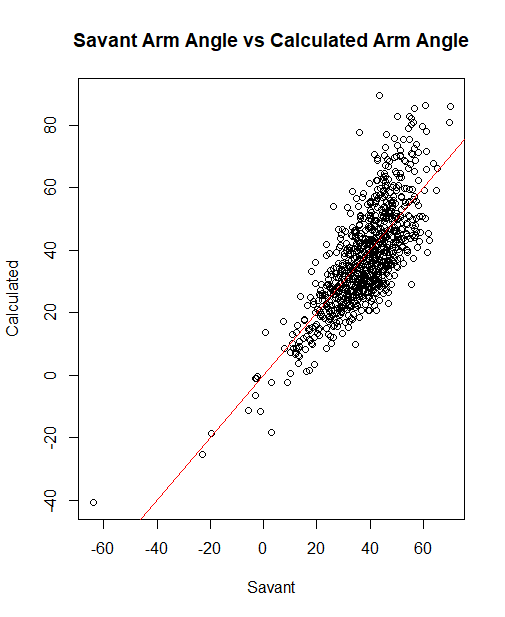

# Arm Angle Calculation Validation

## Overview 

While building an R Shiny Trackman app, I initially wanted to include arm angle calculations. However, without access to motion capture data, I couldn't directly compute the angles. I found an article by Logan Mottley (https://web.archive.org/web/20230123183755/https://www.rundownbaseball.com/project/calculating-arm-angles-using-statcast-data/) that approximates arm angle by estimating the pitcher's shoulder height at release as 0.7 x the pitcher's total height and uses basic trig to compute the angle. Since I had access to the data needed for this method (Trackman + Player Heights), I analyzed whether this would allow me to add arm angles into the app without motion capture data.

To test the validity of the method, I compared arm angles using this method to arm angles from Baseball Savant (since when the article was published, Baseball Savant didn't publish arm angles).

## Results

After pulling player heights and merging it with release point and arm angle data, I was left with "arm_angle_data.csv." Here is the plot for the approximated vs savant arm angles:

As you can see, there is definitely a relationship between the two, but there are problems with the calculation for more over the top throwers (which Mottley also talked about in his article).

I also took the mean and median of the absolute difference between the savant and calculated values and got 8.367 and 7.132 degrees respectively.

Because of the difference between the values, I was concerned about the potential for error and as such, decided not to include it in the app. 

